# THE HUM BENEATH

**Ein Dungeon-Abenteuer für den Sinclair QL – komplett in 68000-Assembler.**
**A dungeon adventure for the Sinclair QL – written entirely in 68000 assembler.**

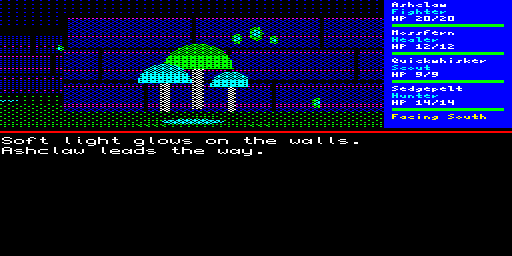

[Deutsch](#deutsch) · [English](#english)

---

## Deutsch

Mit dem Tauwetter kam das Summen: ein tiefer Ton unter dem Moor, den nur die jungen Katzen hören.
Vier von ihnen schleichen sich nachts aus dem Lager. Die Kellertür des verlassenen Hofs steht offen.

- rundenbasiertes Rollenspiel in der Ich-Perspektive, Schritt für Schritt durch 8 Ebenen
  mit eigenen Wänden, Böden, Gegnern und Rätseln: Wurzelkeller, Abflusstunnel, alte Zisterne,
  Schienentunnel, Glühkappenhöhlen, Knochenhallen, stiller Bau, Herzhöhle
- eine Gruppe aus Kämpfer, Heiler, Späher und Jäger, mit Rängen, Wunden, Moos und Kräutern
- Kratzzeichen an den Wänden erzählen, was mit den verschollenen Tiefenwächtern geschah – drei Enden
- jedes neue Spiel verteilt Gegner, Gegenstände und Fallen neu
- Automap, Klänge und kurze Melodien, Bilder zu Intro und Enden
- Deutsch und Englisch, im Titelmenü umschaltbar
- Tastatur, Joystick (CTL1/CTL2) und MiSTer-Gamepads

**Voraussetzungen:** Sinclair QL mit mindestens 384K RAM, oder ein Emulator bzw. MiSTer (RAM auf 640K stellen).

### Download

Die fertigen Spieldateien gibt es unter **[Releases](../../releases/latest)**:

- `thehum.win` – QXL.WIN-Image mit BOOT und Spiel für MiSTer, QPC2, Q-emuLator und QL-SD
- `thehumbeneath-v1.0.zip` – alle Spieldateien inklusive Anleitung (`LIESMICH_README.txt`)

Die ausführliche Anleitung zum Starten (auch auf dem MiSTer), zur Steuerung und zum Spiel
steht in [LIESMICH_README.txt](LIESMICH_README.txt).

### Selbst bauen

```
cd src && ./make.sh      # braucht vasm, Python 3 (Pillow), für das WIN-Image qxltool (32 Bit)
```
`tools/setup_tools.sh` baut vasm, den Emulator sQLux und qxltool, `tools/dist.sh` packt das Release.

---

## English

With the thaw came the Hum: a deep sound below the moor that only the young cats can hear.
Four of them slip out of the camp one night. The cellar door of the abandoned farmstead is open.

- turn-based role playing game in first person view, step by step through 8 levels
  with their own walls, floors, enemies and puzzles: root cellar, drain tunnels, old cistern,
  rail tunnel, glowcap caverns, bone halls, silent warren, heart hollow
- a party of fighter, healer, scout and hunter, with ranks, wounds, moss and herbs
- Scratch-Marks on the walls tell what happened to the lost Deepwardens – three endings
- every new game places enemies, items and traps anew
- automap, sound effects and short tunes, pictures for the intro and the endings
- English and German, switchable in the title menu
- keyboard, joystick (CTL1/CTL2) and MiSTer gamepads

**Requirements:** Sinclair QL with at least 384K RAM, or an emulator / MiSTer (set RAM to 640K).

### Download

Get the ready-to-play files from **[Releases](../../releases/latest)**:

- `thehum.win` – QXL.WIN image with BOOT and game for MiSTer, QPC2, Q-emuLator and QL-SD
- `thehumbeneath-v1.0.zip` – all game files including the manual (`LIESMICH_README.txt`)

How to start the game (including MiSTer), the controls and the game itself are described in
[LIESMICH_README.txt](LIESMICH_README.txt) (English part below the German one).

### Building

```
cd src && ./make.sh      # needs vasm, Python 3 (Pillow), qxltool (32 bit) for the WIN image
```
`tools/setup_tools.sh` builds vasm, the sQLux emulator and qxltool, `tools/dist.sh` packs the release.

---

## Screenshots

| | |
|---|---|
| 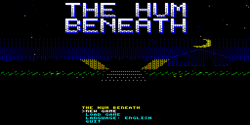 | 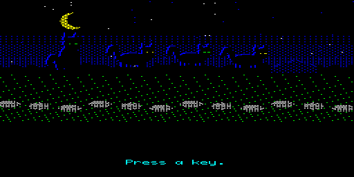 |
| 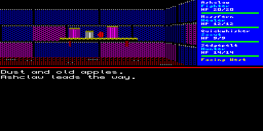 | 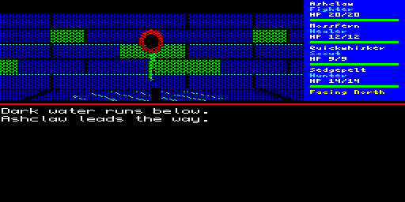 |
| 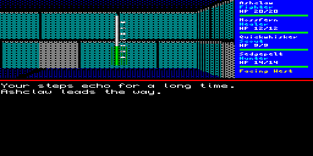 | 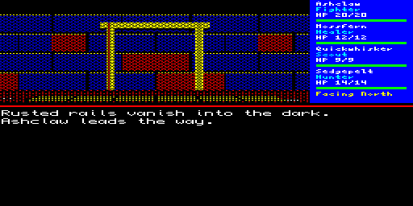 |
| 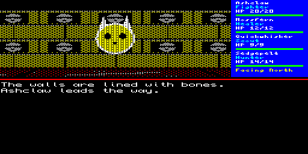 | 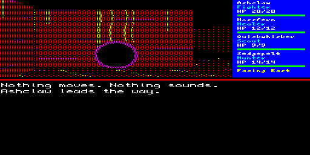 |
| 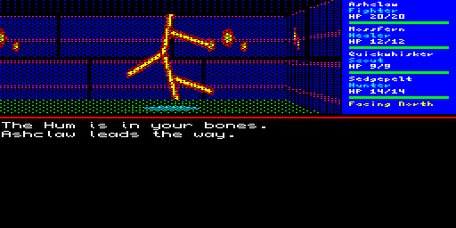 | 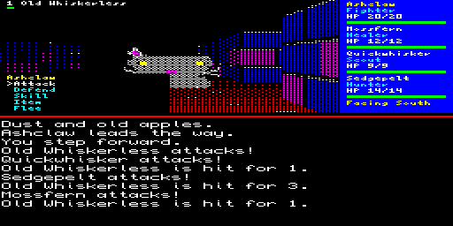 |
| 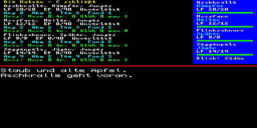 | 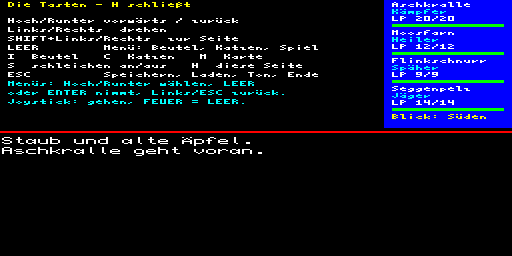 |

---

Idee / Idea: Jungsi · Code: Claude & Jungsi · **[www.jungsi.de](https://www.jungsi.de)**

Lizenz / License: [MIT](LICENSE)
